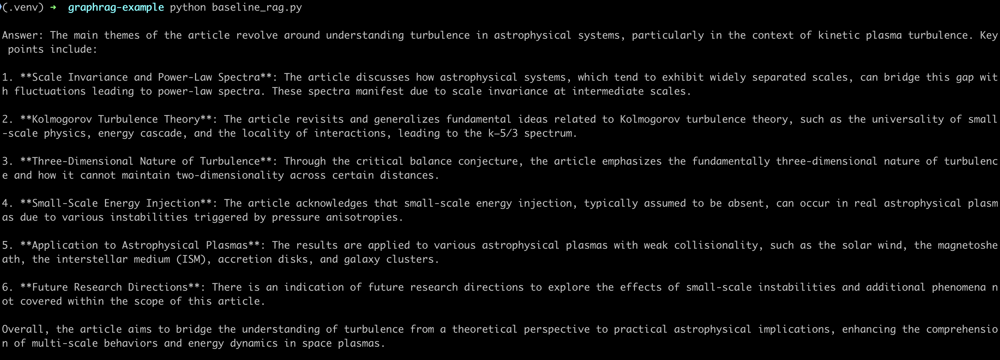
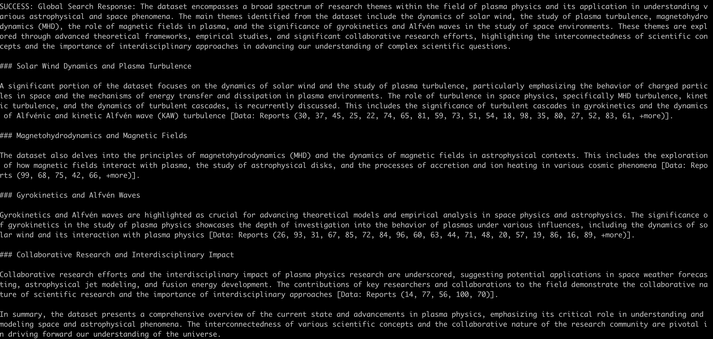

# GraphRAG Example

An experiment to compare "regular" (hereafter referred to as baseline) RAG and [GraphRAG](https://microsoft.github.io/graphrag/).

## Experiment

I indexed my favourite [plasma physics paper](https://arxiv.org/abs/0704.0044) by [Alex Scheckochihin}(https://www-thphys.physics.ox.ac.uk/people/AlexanderSchekochihin) in two different ways. Before indexing, I extracted the pdf into a single text file using the code in [data_extraction.py](./data_extraction.py)

1. Baseline RAG -- chunking the text, calculating embeddings and storing them in [pinecone](https://www.pinecone.io/)
2. GraphRAG -- indexing the graph using their built-in [indexing pipeline](https://microsoft.github.io/graphrag/posts/index/overview/)

And then ran queries against both.

## Results

The query used was `What are the main themes of this article?`. The results were:

